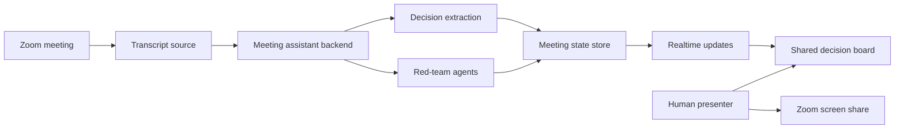

# Zoom Meeting Decision Making Assistant Plan

## Goal

Create a Zoom-compatible meeting assistant that listens to meeting transcript data, maintains a live decision-making page, and gives configured red-team agents a visible way to signal useful interventions without joining the meeting as participants.

## Core Experience

A shared page shows the meeting's emerging decisions in real time:

- Decisions proposed, accepted, rejected, or parked
- Evidence and transcript snippets behind each decision
- Open questions, risks, and assumptions
- Red-team agent "raised hands" with concise interventions
- Host controls for acknowledging, dismissing, or escalating an agent point

The page can be shared by a human attendee at first. A native Zoom App share can come later.

## Recommended MVP

Build a standalone web app that a human attendee opens in a browser and shares in Zoom.

This gives us the fastest path to a real prototype:

- No Zoom App Marketplace setup required for the first demo
- No dependency on RTMS approval before testing the product behavior
- Works in any meeting where someone can share a browser window
- Lets us validate the decision extraction and red-team agent design first

The app should be designed so transcript ingestion is replaceable. We can start with mock transcript input, then swap in Zoom RTMS when access is ready.

## Option A: Human-Shared Web Page

### How it works

A meeting attendee opens the decision board web app and shares that browser window in Zoom. Transcript segments flow into the app from a backend service or test stream. The shared page updates live.

### What we build

- Web decision board
- Transcript ingestion endpoint
- Mock transcript player for demos
- Decision extraction service
- Red-team agent engine
- Agent intervention queue
- Presenter controls

### Pros

- Fastest to build
- Lowest Zoom platform risk
- Easy to test outside Zoom
- Human presenter stays in control of what enters the discussion

### Cons

- Not fully native to Zoom
- Human must manually share the page
- Live transcript still needs RTMS, another transcription source, or mock input

## Option B: Zoom App With Shared App Surface

### How it works

Build a Zoom App that runs inside the Zoom client. The app can present the decision board and use Zoom Apps SDK capabilities such as app sharing. The host or user can share the app surface directly from Zoom.

### What we build

- Zoom App frontend
- Zoom Apps SDK integration
- Backend auth and meeting context handling
- Same decision board and agent engine from Option A

### Pros

- More native Zoom experience
- Better path to in-meeting controls
- Can eventually pair cleanly with RTMS

### Cons

- More setup and review friction
- Must handle Zoom SDK capabilities and running contexts
- Still requires separate backend logic for transcript and agents

## Option C: Zoom App Plus RTMS

### How it works

Use Zoom Realtime Media Streams to receive live transcript data from meetings. The backend processes transcript segments, extracts decisions, runs red-team agents, and pushes updates to the shared decision board.

### What we build

- RTMS-enabled Zoom app
- RTMS webhook receiver
- Transcript stream processor
- Decision extraction pipeline
- Red-team agent orchestration
- Live websocket updates to the board
- Audit, consent, and retention controls

### Pros

- Best long-term architecture
- Bot-free meeting data access
- Can use structured per-participant transcript data
- Better enterprise/security story

### Cons

- RTMS access may require Zoom enablement, licensing, or admin approval
- Requires host/admin consent and disclosure flows
- More engineering and operational complexity

## Option D: Meeting Bot Fallback

### How it works

A bot joins the meeting as a participant, captures audio/transcript, and feeds the decision board.

### Pros

- Technically common and well understood
- Can work without RTMS access

### Cons

- Conflicts with the goal that agents are not attendees
- Less trusted meeting experience
- More awkward consent and privacy posture
- Not the preferred path

## Red-Team Agent Model

Agents should be configured like skills. Each agent has a purpose, trigger rules, constraints, and output style.

Example agent types:

- Premortem agent: looks for ways a decision might fail
- Missing stakeholder agent: flags absent perspectives
- Evidence quality agent: challenges unsupported claims
- Reversibility agent: asks whether a decision is one-way or reversible
- Compliance agent: watches for policy, legal, or security risks
- Customer impact agent: checks whether the customer/user consequence is explicit

Candidate agents based on the RTT materials:

- Six Strategic Questions agent: checks whether the group has named the problem, the tradeoffs, and the desired end state.
- On the Contrary agent: challenges assertions by asking whether the opposite could also be true or whether another explanation fits.
- Assumptions Challenge agent: surfaces stated and unstated assumptions behind a decision and asks what would happen if they prove false.
- Problem Restatement agent: detects when the group may be solving too quickly and suggests wider, narrower, inverted, or shifted framings.
- Pre-Mortem agent: imagines a proposed plan failing and identifies likely failure paths, mitigations, and early warning signs.
- Argument Dissection agent: evaluates whether an argument addresses the real problem, uses strong evidence, avoids vague language, and considers rival causes.
- Outside-In agent: scans for external social, technological, economic, environmental, political, legal, or ethical forces that could affect the decision.
- Influencer Engineering agent: flags stakeholders, supporters, opponents, and showstoppers who could affect success.
- Four Ways of Seeing agent: examines how key stakeholders see themselves, each other, and the proposed plan.
- Alternative Futures agent: prompts the group to consider multiple plausible futures when uncertainty is high.
- Mind the Gap agent: compares stated goals with likely outcomes and flags disconnects between strategy and actual practice.
- The Enemy Within agent: looks for self-defeating behaviors the organization may already be doing or considering.

The first prototype should include Assumptions Challenge, Pre-Mortem, and Argument Dissection. Portable skill folders for these agents live under `skills/` so the meeting tool can load them and CLI users can invoke them directly.

Example configuration shape:

```yaml
id: missing-stakeholder
name: Missing Stakeholder
purpose: Identify decisions being made without affected parties represented.
triggers:
  - decision_detected
  - commitment_detected
threshold: medium
intervention_style: concise
constraints:
  max_words: 45
  require_transcript_evidence: true
  avoid_repeating_recent_points: true
```

## Agent "Raised Hand" Behavior

Agents do not join Zoom as attendees. They appear inside the shared decision page.

An agent hand raise should include:

- Agent name
- Severity or urgency
- One-sentence reason
- Suggested intervention
- Transcript evidence
- Actions: acknowledge, discuss, dismiss, convert to risk, convert to open question

The meeting host or presenter decides whether to bring the agent point into the conversation.

## Suggested Architecture



## Build Phases

### Phase 1: Prototype

- Standalone web decision board
- Timed mock transcript playback
- VTT and TXT transcript import
- Basic decision extraction
- Three red-team agents
- Human-shared browser page

### Phase 2: Live Backend

- Realtime transcript ingestion abstraction
- Websocket updates
- Persistent meeting state
- Agent configuration files
- Presenter moderation controls

### Phase 3: Zoom Integration

- Zoom App shell
- Meeting context and auth
- Optional app share flow
- RTMS proof of concept once access is available

### Phase 4: Production Readiness

- Admin controls
- Consent and disclosure copy
- Data retention settings
- Audit log
- Workspace/team configuration
- Export decisions and action items

## MVP Decisions and Open Questions

### Current MVP Decisions

- The first demo should use mock transcript data. Real meeting transcripts can be added as test fixtures.
- Mock transcript fixtures should support VTT and TXT. Meeting exports are usually VTT, while the current sample transcript is TXT generated by Wisper.
- The transcript view should display time codes and speaker names when available. TXT imports may not include timestamps or speaker labels, so those fields should be optional.
- The primary operator is the meeting host.
- Mock transcripts should replay on a timer so the prototype feels like a real meeting and interaction timing can be tested.
- The meeting dashboard should be accessible through a URL that anyone can open for now, but the URL should not be easily guessable.
- Eventually, dashboard access should be restrictable by account login, likely Google or Zoom.
- The prototype should retain the full transcript with the meeting record.
- Agents should only queue suggestions in the shared page. They should not interrupt the meeting automatically.
- If the team starts discussing the same topic an agent raised, that agent can become more engaged in the page and add follow-up text.
- Decision handling should start as lightweight capture, not formal voting or approval.
- Later, decisions may support actions such as logging to a decision log.
- Post-meeting access should start with a meeting dashboard URL that can be copied and revisited.

### Remaining Questions

- How should the meeting app invoke each skill: locally, through a backend worker, or through a model API abstraction?

## Transcript Retention

Transcript retention means how long the system keeps the raw meeting transcript after processing it.

This matters because transcript text can contain sensitive company, customer, personnel, legal, strategy, or product information. We can separate retention into different levels:

- Raw transcript: the full text of what people said
- Processed meeting state: decisions, risks, open questions, and agent suggestions
- Evidence snippets: short transcript excerpts attached to decisions or risks
- Derived metadata: timestamps, speaker names, confidence scores, and agent trigger events

For the prototype, the default should be:

- Keep mock transcript fixtures in the project for testing.
- Keep the full transcript attached to the meeting record.
- Keep derived decisions, risks, open questions, and agent suggestions in the meeting dashboard.
- Let the host remove or replace uploaded transcripts during testing.
- Revisit retention controls before production so teams can choose how long raw transcripts are kept.

## Recommendation

The decided direction is to start with Option A and move to Option C after the product format is working well.

The first build should be a human-shared web page with mock transcript support and configurable red-team agents. That gets the product behavior into real meetings quickly and lets us discover the right decision-board format before taking on Zoom App and RTMS complexity.

Once the workflow feels useful, add Zoom App and RTMS integration for a native, bot-free experience.


## Current Prototype Behavior Decisions

- Agent issues only suggest when the transcript appears to overlap with the issue. The host confirms by clicking Discussed or Dismissed.
- Decisions enter the board as pending. The host accepts or rejects them from the decision modal.
- Rejected decisions and dismissed risks, actions, or agent issues move to the audit tray instead of disappearing.
- The screen is optimized for screen share, with the host operating the controls during the meeting.
- Zoom integration options are tracked in `docs/zoom-integration-options.md`.
